# Overview

Compact open-source solution for database backups.

## What is Backupman?

Backupman is a **minimalist backup system** that handles the essentials:
- Creates database dumps
- Stores backups locally or in cloud services
- Automates scheduled backups with retention rules
- Sends notifications about backup status

## Key Features

- **Multi-Database Support**: MySQL, PostgreSQL, SQLite
- **Hybrid Storage**: Local, Google Drive, S3
- **Smart Retention**: Time-based auto-cleanup
- **Scheduled Backups**: Cron-like scheduling
- **Real-time Monitoring**: Email, Webhook notifications
- **Simple Interfaces**: CLI, HTTP API

## Backup Sequence

```mermaid
graph TB
  A[(Data Sources)] -->|Dump| B[/Temporary Folder/]
  B -->|Upload| C[Drive]
  C -->|Successful?| D{Decision}
  D -->|Yes| E[🗑️ Delete temporary file]
  D -->|No| F[Retain dump file]
  E & F -->|Notification| G[📧 Send Email Report]
  G -->|Event Broadcast| H[🌐 Trigger Webhook]
```

